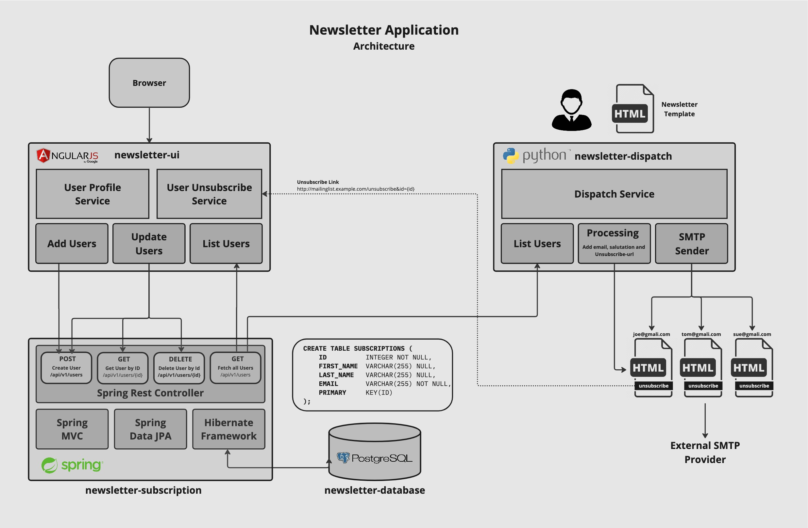

# Newsletter Application - A Spring Boot / AngularJS / PostgreSQL CRUD showcase

This Project has been designed as a demo application for the Tanzu Applicaiton Platform (TAP). It's
microservice architecture is basing on the Newsletter WebUI (newsletter-ui) basing on AngularJS, the 
Subscription Service (newsletter-subscription) basingon Spring Boot and a PostgreSQL database backend
(newsletter-db). 

The picture below shows the architecture of the Newsletter Application:

### Applicaiton Components
- Newsletter User Interface (newsletter-ui)
- Newsletter User Service (newsletter-user-service)
- Newsletter User Database (newsletter-user-db)
- Newsletter Sailing Service (newsletter-mailing-service)

## Newsletter User Interface (newsletter-ui)
The Newsletter User Interface is a Web Frontent basing on AngularJS that allows user to signup to the Newsletter. The Interface allows users to
register themself to the Newsleter Service and modify or delete their data records afterwards. The Newsleter User Interfaces interacts with the
API provided Newsleter User Service to abstract direct connection to the Newsletter User Database.

## Newsletter Subscription Service (newsletter-Subscription)
The Newsletter Subscription Service is the Backend of the Newsletter User Interface and provides an interface (RestFULL) for the application components
(newletter-ui or the mailing-service) to interact with cwits API. The the Newsletter User Service uses a PostgreSQL database backend to store
persistent user data records. This abstraction allows better to controll who is acessing the service and new service features can be implemented
by introducting a new API Version. As well its planned to integrate a circuit breaker in the NEwsleter User Service in a fulure version to prent
the service from overloading.

## Newsletter User Database (newsletter-newsletter-db)
The Newsletter Database acts as backend for the Newsletter Subscription Service and is basing on a PostgreSQL Database running in a container with
the same Kubernetes Namespace as the application. The Database is deployed and Managed trough the PostgreSQL Operator running in the default namespace
of the same cluster. Morge information about the VMware PostgreSQL Operator can be seen in the documentation
[VMware SQL with Postgres for Kubernetes Operator](https://docs.vmware.com/en/VMware-SQL-with-Postgres-for-Kubernetes/2.0/vmware-postgres-k8s/GUID-install-operator.html).

## Newsletter Mailing Service (newsletter-mailing-service)
the Newsletter Mailing Service is a Phyton based application started by the Newsletter Administrator to generation a mass mailing based on the Newsletter
registered users provided by the Newsletter User Service API. The Newsletter Mailing Service processes the provided Newsletter template and complement it
with the users salutation, email address and unsuscribe-url basing on the registered user-id. Thous malings will then be sent to the configured external
Mail Service Provided via SMTP.

Deployment Scenarios
The Newsletter application can be deployed local on a Workstation / Laptop which usually the first choise of a developer with the limitation
that backensystems (database etc.) requires to be simulated as well as other procects API's which can not be accessed on a local environent. The second
deployment option is on top of kubernetes cluster deployed with Tanzu Applicaiton Platform (TAP) that automaticly generate a supply chain depending
on the applicaiotn needs.

### Deployment Options
- [Deploy on the local Laptop/Workstation](catalog/docs/deploy_local.md)
- [Deployment on Tanzu Applicaiton Platform (TAP)](catalog/docs/deploy_tap.md)

See [Local Deployment](catalog//docs/deploy_local.md)

