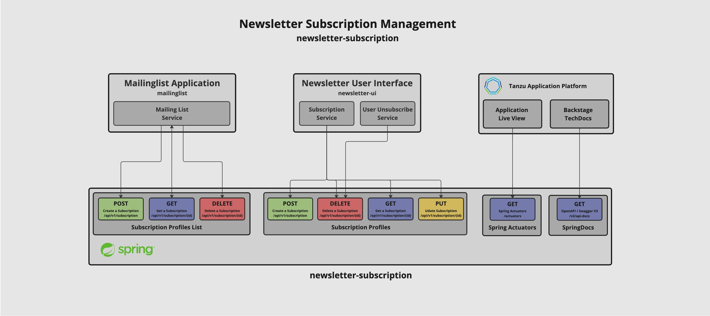

# Newsletter Subscription Service API

The Newsletter Subscription Service API is the interface to the PostgreSQL Database backend. It allows to create, delete, list and modifies subscriptions 
of the Newsletter Service trough a REST API interface that allows to cache similar requests or implement a service breaker in case of maintenance of 
the backend database.

The picture below shows the API structure of the Newsletter subscription Service:

### Depending Services
- Mailinglist Application 
- Newsletter USer Interface (newsletter-ui)
- Tanzu Applicaiton Platform

## Mailinglist Application
The Mailinglist Application is part of the eCommerce Marketplace Marketing intitiative and allows to perform newsletter mailings to many users 
provided by a list of recipient. Thous requests are handled tbe the Newsleter Subscription List API Interface where multiple subscription records 
can be modified, create or deleted from the Subscription service.

## Newsletter User Interface (newsletter-ui)
The Newsletter User Interface is a Web Frontent basing on AngularJS that allows user to signup to the Newsletter. The Interface allows users to 
register themself to the Newsleter Service and modify or delete their data records afterwards. The Newsleter User Interfaces interacts with the 
API provided Newsleter Subscription Service API to abstract direct connection to the Newsletter User Database. Authentificated users are able to 
manage their own Newsletter Subscription by create, modify or deleting their personal subscription trough the provided user interface. 

