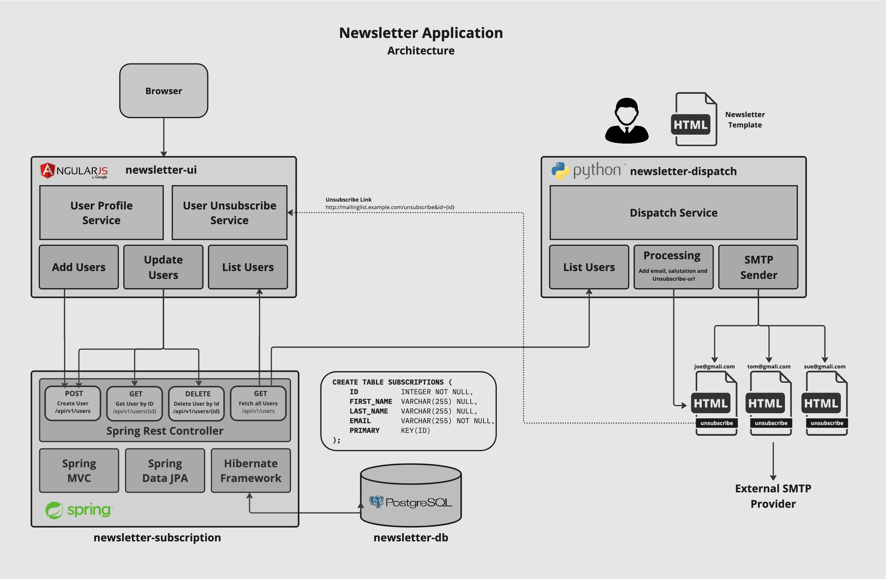

# Newsletter Database (components/newsletter-db/docs/index.md)
The Newsletter Database acts as backend for the Newsletter User Service and is based on a PostgreSQL Database running in a container with
the same Kubernetes Namespace as the application. The Database is deployed and managed trough the PostgreSQL Operator running in the default namespace
of the same cluster. More information about the VMware PostgreSQL Operator can be seen in the documentation
[VMware SQL with Postgres for Kubernetes Operator](https://docs.vmware.com/en/VMware-SQL-with-Postgres-for-Kubernetes/2.0/vmware-postgres-k8s/GUID-install-operator.html).

The picture below shows the architecture of the Newsletter Application:


## Database deployment on Tanzu Application Platform (TAP)
This section describes how to deploy a PostgreSQL Database directly from the 'Bitnami Services' integrated in Tanzu Application Platform (TAP). After the
deployment application teams will be able to discover, claim, and bind services to their application workloads
[Working with Bitnami Services](https://docs.vmware.com/en/VMware-Tanzu-Application-Platform/1.5/tap/bitnami-services-tutorials-working-with-bitnami-services.html)

### Create a Service Class-Claim

Installation Steps and Prerequisists:
- Access to a Tanzu Application Platform cluster v1.5.0 and later
- The Tanzu services CLI plug-in v0.6.0 and later

The following steps explain how to work with Bitnami Services.
```
$ tanzu service class list
```
The expected output is similar to the following:
```
  NAME                  DESCRIPTION
  mysql-unmanaged       MySQL by Bitnami
  postgresql-unmanaged  PostgreSQL by Bitnami
  rabbitmq-unmanaged    RabbitMQ by Bitnami
  redis-unmanaged       Redis by Bitnami
```
Here the output shows 4 classes. These are the four pre-installed Bitnami Services. You can see from the names and descriptions that they are all unmanaged services. This implies that the resulting service instances run on cluster, that is, they are not a managed service running in the cloud. Other classes might be listed here as well.

You can learn and discover more about a class by running:
```
$ tanzu service class get postgresql-unmanaged
```
The expected output is similar to the following:
```
NAME:           postgresql-unmanaged
DESCRIPTION:    PostgreSQL by Bitnami
READY:          true

PARAMETERS:
  KEY        DESCRIPTION                                                  TYPE     DEFAULT  REQUIRED
  storageGB  The desired storage capacity of the database, in Gigabytes.  integer  1        false
```
To create the claim in a namespace, you must first create the namespace by running:
```
$ tanzu service class-claim create newsletter-db --class postgresql-unmanaged --parameter storageGB=3 -n $TAP_DEVELOPER_NAMESPACE
Creating claim 'newsletter-db' in namespace 'newsletter'.
```
Please run `tanzu services class-claims get newsletter-db --namespace $TAP_DEVELOPER_NAMESPACE` to see the progress of create.

```
$ tanzu service class-claim get newsletter-db  --namespace $TAP_DEVELOPER_NAMESPACE
Name: newsletter-db
Namespace: newsletter
Claim Reference: services.apps.tanzu.vmware.com/v1alpha1:ClassClaim:newsletter-db
Class Reference:
  Name: postgresql-unmanaged
Parameters:
  storageGB: 3
Status:
  Ready: True
  Claimed Resource:
    Name: 101fb718-d596-479c-8e3d-8e966a06e4ec
    Namespace: <namespace>
    Group:
    Version: v1
    Kind: Secret
```
### Verify the database Deployment
The class-claim for the newsletter database (newsletter-db) has been created and the PostgreSQL Database is now provisioned in a seperate kubernetes namespace (newsletter-db-wgk2h).
```
tanzu@tdh-tools:~/newsletter$ kubectl get ns | grep newsletter-db
newsletter-db-wgk2h            Active   35m
```
```
tanzu@tdh-tools:~/newsletter$ kubectl get all,secrets -n newsletter-db-wgk2h
NAME                        READY   STATUS    RESTARTS   AGE
pod/newsletter-db-wgk2h-0   1/1     Running   0          10m

NAME                             TYPE        CLUSTER-IP     EXTERNAL-IP   PORT(S)    AGE
service/newsletter-db-wgk2h      ClusterIP   10.96.104.52   <none>        5432/TCP   10m
service/newsletter-db-wgk2h-hl   ClusterIP   None           <none>        5432/TCP   10m

NAME                                   READY   AGE
statefulset.apps/newsletter-db-wgk2h   1/1     10m

NAME                                                     TYPE                                DATA   AGE
secret/newsletter-db-wgk2h                               connection.crossplane.io/v1alpha1   8      11m
secret/sh.helm.release.v1.newsletter-db-wgk2h-kqgg6.v1   helm.sh/release.v1                  1      11m
```
A secret hast been created holding the database user and password.
```
tanzu@tdh-tools:~/newsletter$ kubectl -n newsletter-db-wgk2h  get secrets newsletter-db-wgk2h -o json | jq -r '.data'
{
  "database": "bmV3c2xldHRlci1kYi13Z2syaA==",
  "host": "bmV3c2xldHRlci1kYi13Z2syaA==",
  "password": "Nzl6cTBxdjA4b2xucHZoMTRwbWZsaWw0dHMxcmxkb2Y=",
  "port": "NTQzMg==",
  "postgres-password": "Nzl6cTBxdjA4b2xucHZoMTRwbWZsaWw0dHMxcmxkb2Y=",
  "provider": "Yml0bmFtaQ==",
  "type": "cG9zdGdyZXNxbA==",
  "username": "cG9zdGdyZXM="
}
```
The application deployment does not require to have the details about the newletter-db. This is all managed by the TAP Service Broker that manages the access to the database resource. The developer only requires to have a 'serviceClaim' contiguration for the newsletter-db in his workload.yaml.
```
apiVersion: carto.run/v1alpha1
kind: Workload
metadata:
  name: newsletter-subscription
  labels:
    apps.tanzu.vmware.com/workload-type: web
    app.kubernetes.io/part-of: newsletter
    apps.tanzu.vmware.com/has-tests: "true"
    apis.apps.tanzu.vmware.com/register-api: "true"
    apps.tanzu.vmware.com/debug: "true"
  annotations:
    autoscaling.knative.dev/minScale: "1"
spec:
  serviceClaims:
    - name: db
      ref:
        apiVersion: services.apps.tanzu.vmware.com/v1alpha1
        kind: ClassClaim
        name: newsletter-db
....
```
As the newsletter database on creation time has been configured to be accessed from any application running within the developer namespace 'newsletter'.


### Set the backstage 'part-of' label
In order for backstage techdocs and the TAP application live view to finde the database pods, a kubernetes label 'part-of' needs
to be added to the pods.
```
$ kubectl -n newsletter-db-wgk2h label pod/newsletter-db-wgk2h-0 app.kubernetes.io/part-of=newsletter
pod/newsletter-db-0 labeled
```
### Deboug the database deployments
In case of a problem, the commands shown below should help identifing the issue.
```
# --- SHOW NAMESPACE RELEATED EVENTS ---
$ kubectl -n <TAP_DEVELOPER_NAMESPACE> get events
```

```
# --- SHOW THE CONTAINER LOGS ---
$ kubectl -n newsletter-db-wgk2h logs newsletter-db-wgk2h-0
postgresql 20:14:23.26
postgresql 20:14:23.26 Welcome to the Bitnami postgresql container
postgresql 20:14:23.27 Subscribe to project updates by watching https://github.com/bitnami/containers
postgresql 20:14:23.27 Submit issues and feature requests at https://github.com/bitnami/containers/issues
postgresql 20:14:23.28
postgresql 20:14:23.32 INFO  ==> ** Starting PostgreSQL setup **
postgresql 20:14:23.35 INFO  ==> Validating settings in POSTGRESQL_* env vars..
postgresql 20:14:23.37 INFO  ==> Loading custom pre-init scripts...
postgresql 20:14:23.38 INFO  ==> Initializing PostgreSQL database...
postgresql 20:14:23.44 INFO  ==> pg_hba.conf file not detected. Generating it...
postgresql 20:14:23.44 INFO  ==> Generating local authentication configuration
postgresql 20:14:24.40 INFO  ==> Starting PostgreSQL in background...
postgresql 20:14:24.64 INFO  ==> Changing password of postgres
postgresql 20:14:24.69 INFO  ==> Configuring replication parameters
postgresql 20:14:24.77 INFO  ==> Configuring synchronous_replication
postgresql 20:14:24.77 INFO  ==> Configuring fsync
postgresql 20:14:24.87 INFO  ==> Stopping PostgreSQL...
waiting for server to shut down.... done
```

### Accessing to the Database
The PostgreSQL can be accessed from from withing the docker container. This is only usefil for debuggin reasons and may not be
available in production environment because of lack of permission. At first get the credentials from the database secret.
```
ä kubectl -n newsletter-db-wgk2h get secrets newsletter-db-wgk2h -o json | jq -r '.data.username' | base64 -d
postgres
ä kubectl -n newsletter-db-wgk2h get secrets newsletter-db-wgk2h -o json | jq -r '.data."postgres-password"' | base64 -d
79zq0qv08olnpvh14pmflil4ts1rldof
```
Now login in to the docker container with the optained credentials
```
$ kubectl -n newsletter-db-wgk2h exec -it newsletter-db-wgk2h-0 -- bash
I have no name!@newsletter-db-wgk2h-0:/$
```
Now you are inside the PosrgreSQL docker container and can connect to the database as root. Additionally as the psql utility is available
in the container as well, you dont need to install it seperatly. Now the connedt to the database instance:
```
I have no name!@newsletter-db-wgk2h-0:/$ psql -h localhost -p 5432 -U postgres
Passowrd: <enter-pasword>

psql (15.2)
Type "help" for help.

postgres=# \l
                                                                         List of databases
     Name      |           Owner           | Encoding | Collate |  Ctype  | ICU Locale | Locale Provider |                    Access privileges
---------------+---------------------------+----------+---------+---------+------------+-----------------+---------------------------------------------------------
 newsletter-db | pgautofailover_replicator | UTF8     | C.UTF-8 | C.UTF-8 |            | libc            | pgautofailover_replicator=CTc/pgautofailover_replicator+
               |                           |          |         |         |            |                 | postgres_exporter=c/pgautofailover_replicator          +
               |                           |          |         |         |            |                 | pgappuser=CTc/pgautofailover_replicator                +
               |                           |          |         |         |            |                 | pgrouser=c/pgautofailover_replicator                   +
               |                           |          |         |         |            |                 | pgrwuser=c/pgautofailover_replicator
 postgres      | postgres                  | UTF8     | C.UTF-8 | C.UTF-8 |            | libc            | postgres=CTc/postgres                                  +
               |                           |          |         |         |            |                 | pgautofailover_monitor=c/postgres                      +
               |                           |          |         |         |            |                 | postgres_exporter=c/postgres
 template0     | postgres                  | UTF8     | C.UTF-8 | C.UTF-8 |            | libc            | =c/postgres                                            +
               |                           |          |         |         |            |                 | postgres=CTc/postgres
 template1     | postgres                  | UTF8     | C.UTF-8 | C.UTF-8 |            | libc            | =c/postgres                                            +
               |                           |          |         |         |            |                 | postgres=CTc/postgres
(4 rows)
```
Now change to the Database 'newsletter-db' and show if there a are any tables configured.
```
postgres=# \c newsletter-db
SSL connection (protocol: TLSv1.3, cipher: TLS_AES_256_GCM_SHA384, compression: off)
You are now connected to database "newsletter-db" as user "postgres".
```

