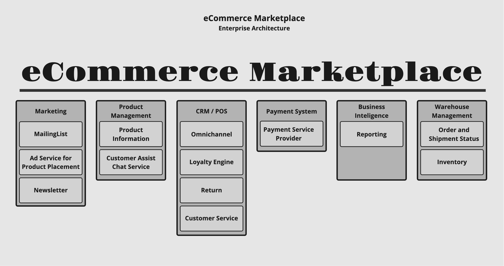

# eCommerce Marketplace
The eCommerce Marketplace represents a collection of BTC Application where our customers can access our eCommerce services and products online. Additionally several application such as the Newsletter and mailinglist application are designed to interact with our customers other are for marketing, research and market analysis.

The picture below shows a collection of the Marketplace applications:

## Newsletter Application - A Spring Boot / AngularJS / PostgreSQL CRUD showcase

This Project has been designed as a demo application for the Tanzu Applicaiton Platform (TAP). It's
microservice architecture is basing on the Newsletter WebUI (newsletter-ui) basing on AngularJS, the
Subscription Service (newsletter-subscription) basingon Spring Boot and a PostgreSQL database backend
(newsletter-db).

